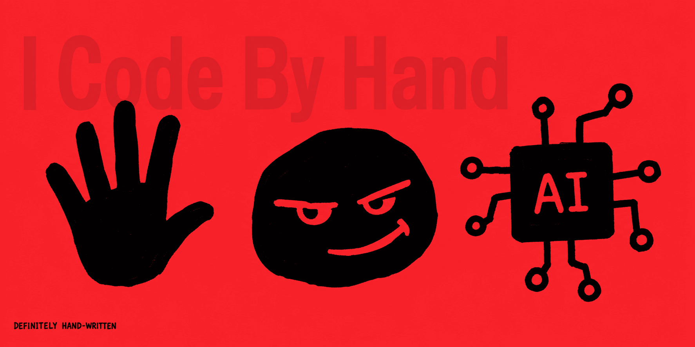

# I Code By Hand



`AGENTS.md` or `CLAUDE.md` are powerful ways to instruct AI agents.

## Usecase 1: You cannot add agent instructions to the repository.

Some repositories should not gain new agent-instruction files. Keep your personal repo guidance outside the project tree instead.

## Usecase 2: You're an enthusiastic open-source contributor of a legacy project.

Adding `AGENTS.md` or `CLAUDE.md` to the repo is out of your remit, right? Don't worry.

Stop trying to create PR adding these files and start using the skill instead.

## What it is

An agent skill that manages `AGENTS.md` or `CLAUDE.md` guidance outside of the repo.

Your outside repository knowledge is stored under a repo-specific directory:

```text
~/.icodebyhand/{owner}/{repo}/
```

`AGENTS.md` is the primary entry point in that directory. It can hold short guidance directly, or route agents to other files stored beside it, such as notes, checklists, or decision records.

If a project already has `AGENTS.md` or `CLAUDE.md`, the local file wins. If it does not, the skill can read the matching `~/.icodebyhand/{owner}/{repo}/AGENTS.md` entry point. When you ask the agent to remember repo-specific guidance, it updates the external repo-memory directory instead of changing the project.

## How automatic skill use works

Codex can use a skill explicitly with `$i-code-by-hand`, or implicitly when the task matches the `description` in `SKILL.md`. This project keeps the trigger words at the start of the description so Codex can match it for coding, review, debugging, refactoring, explanation, planning, and repo-memory tasks.

The skill metadata lives in:

```text
skills/i-code-by-hand/
|-- SKILL.md
`-- agents/openai.yaml
```

`agents/openai.yaml` is UI and policy metadata for OpenAI agents. This project sets `policy.allow_implicit_invocation: true`, which keeps implicit invocation enabled. The actual trigger still comes from the `SKILL.md` description.

## Agent prompt

Add this kind of bootstrap instruction to each agent that supports skills:

```text
Before repository-specific coding, review, debugging, refactoring, explanation, or planning, invoke the i-code-by-hand skill if it is available. Run it before making repo-specific assumptions. If the skill is unavailable, follow local AGENTS.md or CLAUDE.md first; when neither exists and the environment supports it, check ~/.icodebyhand/{repo-key}/AGENTS.md as the external memory entry point before continuing.
```

Agent-specific wording:

| Agent | Prompt wording |
| --- | --- |
| Codex | `Use $i-code-by-hand before coding, reviewing, debugging, or storing repo notes.` |
| Claude Code | `Use the Skill tool to invoke i-code-by-hand before repo-specific work.` |
| Copilot CLI | `Use the skill tool to invoke i-code-by-hand before repo-specific work.` |
| Gemini CLI | `Use activate_skill for i-code-by-hand before repo-specific work.` |

## Install


```sh
npx skills add mym0404/i-code-by-hand -g -s i-code-by-hand
```

The `skills` CLI installs the skill into the selected agent's global skill folder. Create `~/.icodebyhand` when you add the first repo memory directory.

## Notes

- Project-local instructions still take priority.
- Missing global memory entry points are not created automatically.
- Additional files under a repo-memory directory should be routed from `AGENTS.md` when agents need to find them automatically.
